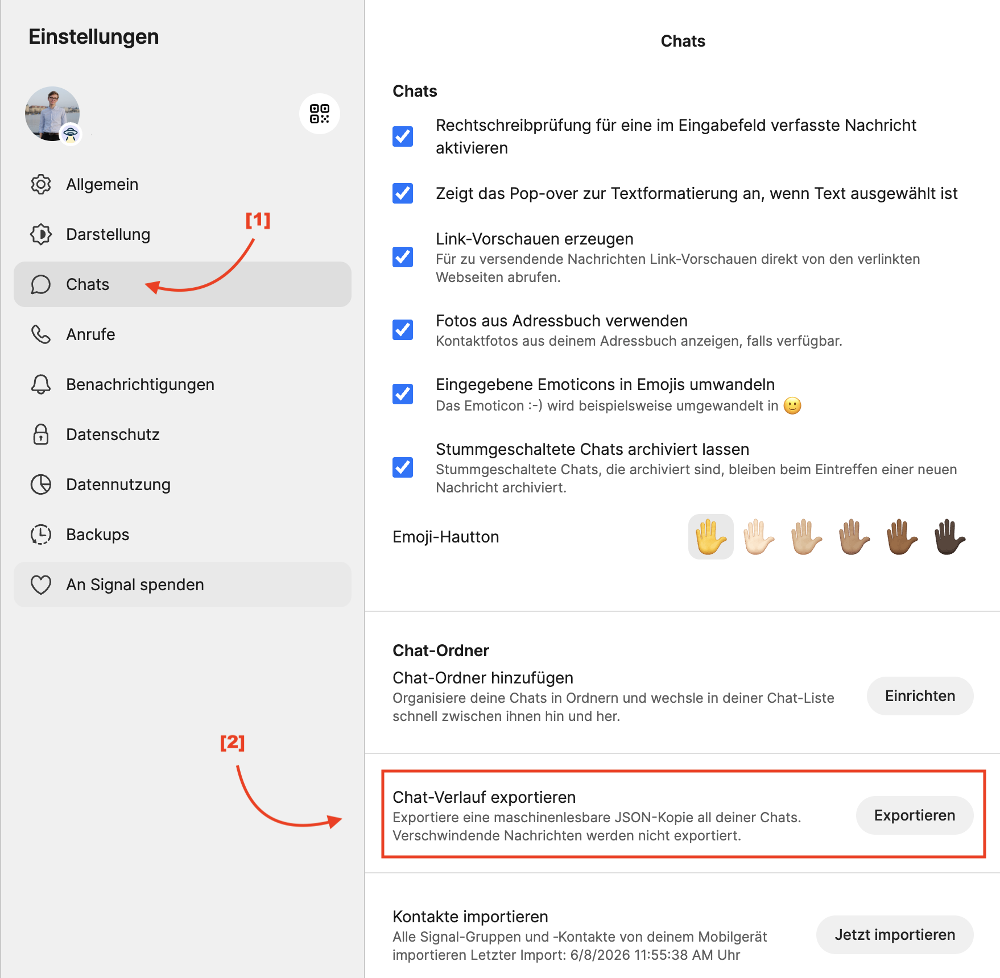

# signalr

Tools to analyse signal chat exports using R.

### Setup
1. Export your chats from within Signal. As of my knowledge, you need to be doing this from a computer. Go to `Settings => Chats => Export Chats`. 

Show visual guide

  

2. Move the exported signal folder into the `data/` directory.
3. Create a `figs/` folder to save figures.

> [!WARNING]
> I recommend exporting the signal archive fresh each time and deleting it after use to keep your chats as private as possible, because the signal export is not encrypted in any way and can be read by anyone with access to your disk and or cloud storage. I would not recommend storing it in cloud storage at all, at least not unencrypted.

# Script Usage

### [I] `create_tables.R`
Reads in signal chats and creates a table linking messages to senders. 
ToDo:
* read author name automatically
* get chat / group names by recipient names
* clean messages

### [II] `chat_stats.R` 
Provides functions to analyse signal chats. Requires `create_tables.R` to have run beforehand.

### [III] `area_chart.R` 
Plots an area chart for a group chat which displays message activity by member over time. Requires `create_tables.R`  and `chat_stats.R` to have run beforehand.